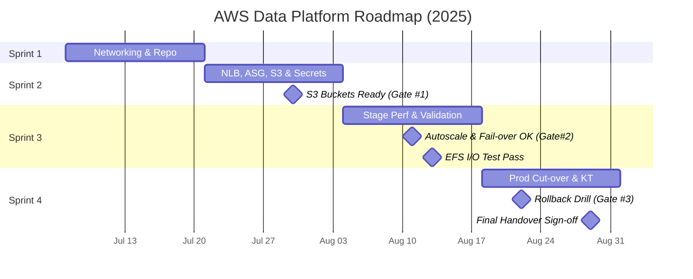

## Technical Architecture

---

### System Overview

<details>
<summary>Comprehensive description of the AWS Data Platform foundation</summary>

---


* **Purpose**: <em>Describe the high‑level objectives of the data platform (analytics, ML, BI, etc.).</em>
* **High‑level Infrastructure Diagram**: Diagram summarizing core services.
  
  ```mermaid
  graph TB
    subgraph "🌐 User Connectivity"
        Users[👥 Business Users<br/>Data Scientists, Analysts, Engineers]
        AdminAccess[🔐 Secure Access<br/>AWS Session Manager<br/>No VPN Required]
    end
    
    subgraph "☁️ AWS Cloud Infrastructure"
        subgraph "🏢 Primary Datacenter (Singapore)"
            subgraph "🔒 Private Secure Zone (Private Network)"
                subgraph "📊 Data Processing Layer"
                    NLB[⚖️ Load Balancer<br/>Network Load Balancer<br/>📈 Auto-distribute traffic]
                    
                    subgraph "🏗️ Server Cluster Zone A"
                        Workers1[💻 Data Processing Servers<br/>Auto Scaling Group: 2-10 instances<br/>🚀 Auto-scale based on demand]
                        Auth1[🔐 Authentication Server A<br/>FreeIPA Master<br/>👤 Employee account management]
                    end
                    
                    subgraph "🏗️ Server Cluster Zone B"
                        Workers2[💻 Data Processing Servers<br/>Auto Scaling Group: 2-10 instances<br/>🚀 Auto-scale based on demand]
                        Auth2[🔐 Authentication Server B<br/>FreeIPA Replica<br/>🛡️ Authentication system backup]
                    end
                end
                
                subgraph "💾 Data Storage Layer"
                    EFS[📁 Shared File System<br/>Amazon EFS<br/>💰 Pay-as-you-use<br/>🔄 Auto-scale from GB to PB]
                end
            end
            
            subgraph "🛡️ Security & Operations Services"
                SecMgr[🔑 Password Management<br/>AWS Secrets Manager<br/>🔐 Secure credential storage]
                Monitoring[📈 System Monitoring<br/>CloudWatch<br/>📊 Dashboards & Alerts]
                Backup[💿 Automated Backup<br/>AWS Backup<br/>📅 Daily scheduled backups]
            end
        end
    end
    
    %% User Flow
    Users --> AdminAccess
    AdminAccess --> NLB
    
    %% Load Distribution
    NLB --> Workers1
    NLB --> Workers2
    NLB --> Auth1
    NLB --> Auth2
    
    %% Authentication Flow
    Workers1 --> Auth1
    Workers2 --> Auth2
    Auth1 -.->|🔄 Sync| Auth2
    
    %% Data Access
    Workers1 --> EFS
    Workers2 --> EFS
    
    %% Security & Operations
    Workers1 --> SecMgr
    Workers2 --> SecMgr
    Workers1 --> Monitoring
    Workers2 --> Monitoring
    EFS --> Backup
    
    %% Styling
    classDef userClass fill:#e1f5fe,stroke:#01579b,stroke-width:2px
    classDef computeClass fill:#f3e5f5,stroke:#4a148c,stroke-width:2px
    classDef storageClass fill:#e8f5e8,stroke:#1b5e20,stroke-width:2px
    classDef securityClass fill:#fff3e0,stroke:#e65100,stroke-width:2px
    
    class Users,AdminAccess userClass
    class NLB,Workers1,Workers2,Auth1,Auth2 computeClass
    class EFS storageClass
    class SecMgr,Monitoring,Backup securityClass
  ```
* **High‑level Technical-Detailed Diagram**: Diagram for technical detail design
  ```mermaid
    graph TB
    subgraph "AWS Region: ap-southeast-1"
        subgraph "VPC: 10.0.0.0/16"
            subgraph "Public Subnets"
                subgraph "AZ-1a: 10.0.1.0/24"
                    NLB-1a[Network LB<br/>Port: 80,443,22,389]
                    NAT-1a[NAT Gateway<br/>For outbound traffic]
                end
                subgraph "AZ-1b: 10.0.2.0/24" 
                    NLB-1b[Network LB Target<br/>Cross-AZ redundancy]
                    NAT-1b[NAT Gateway<br/>Backup outbound]
                end
            end
            
            subgraph "Private App Subnets"
                subgraph "AZ-1a: 10.0.10.0/24"
                    ASG-1a[Auto Scaling Group<br/>Min:2, Max:10, Desired:4]
                    EC2-1a[m5.xlarge instances<br/>4vCPU, 16GB RAM<br/>SG: app-servers-sg]
                    FreeIPA-1a[c5.large instance<br/>2vCPU, 4GB RAM<br/>SG: freeipa-master-sg<br/>Ports: 53,88,389,636,464]
                end
                subgraph "AZ-1b: 10.0.20.0/24"
                    ASG-1b[Auto Scaling Group<br/>Min:2, Max:10, Desired:4]
                    EC2-1b[m5.xlarge instances<br/>4vCPU, 16GB RAM<br/>SG: app-servers-sg]
                    FreeIPA-1b[c5.large instance<br/>2vCPU, 4GB RAM<br/>SG: freeipa-replica-sg<br/>Ports: 53,88,389,636]
                end
            end
            
            subgraph "Private Data Subnets"
                subgraph "AZ-1a: 10.0.30.0/24"
                    EFS-MT-1a[EFS Mount Target<br/>SG: efs-sg<br/>Port: 2049/TCP]
                end
                subgraph "AZ-1b: 10.0.40.0/24"
                    EFS-MT-1b[EFS Mount Target<br/>SG: efs-sg<br/>Port: 2049/TCP]
                end
                EFS[Amazon EFS<br/>Encryption: AES-256<br/>Performance: Provisioned<br/>Throughput: 500 MiB/s]
            end
            
            subgraph "VPC Endpoints Subnet: 10.0.50.0/24"
                VPC-EP-SSM[SSM VPC Endpoint<br/>com.amazonaws.region.ssm]
                VPC-EP-S3[S3 Gateway Endpoint<br/>com.amazonaws.region.s3]
                VPC-EP-SM[Secrets Manager Endpoint<br/>com.amazonaws.region.secretsmanager]
            end
        end
    end
    
    subgraph "AWS Managed Services"
        SM[AWS Secrets Manager<br/>KMS Encrypted<br/>Auto-rotation: 30 days]
        CW[CloudWatch<br/>Metrics + Logs + Alarms<br/>Retention: 90 days]
        BACKUP[AWS Backup<br/>Daily: 7 days retention<br/>Weekly: 4 weeks retention]
        SSM[Systems Manager<br/>Session Manager<br/>Patch Manager]
    end
    
    subgraph "External"
        Users[👥 Users<br/>SSH via Session Manager]
        Internet[🌐 Internet]
    end
    
    %% Network Flow - Detailed
    Users -->|HTTPS/443| NLB-1a
    NLB-1a -->|TCP/22| EC2-1a
    NLB-1a -->|TCP/389,636| FreeIPA-1a
    NLB-1a -.->|Health Check| NLB-1b
    
    %% Cross-AZ Replication
    EC2-1a -->|NFS/2049| EFS-MT-1a
    EC2-1b -->|NFS/2049| EFS-MT-1b
    EFS --> EFS-MT-1a
    EFS --> EFS-MT-1b
    
    %% Authentication Flow
    EC2-1a -->|LDAP/389| FreeIPA-1a
    EC2-1b -->|LDAP/389| FreeIPA-1b
    FreeIPA-1a -.->|Replication/389| FreeIPA-1b
    
    %% Auto Scaling
    ASG-1a --> EC2-1a
    ASG-1b --> EC2-1b
    
    %% Security & Monitoring
    EC2-1a -->|HTTPS/443| VPC-EP-SSM
    EC2-1b -->|HTTPS/443| VPC-EP-SSM
    FreeIPA-1a -->|HTTPS/443| VPC-EP-SM
    VPC-EP-SSM --> SSM
    VPC-EP-SM --> SM
    
    %% Outbound Internet
    EC2-1a --> NAT-1a
    EC2-1b --> NAT-1b
    NAT-1a --> Internet
    NAT-1b --> Internet
    
    %% Monitoring & Backup
    EC2-1a -->|CloudWatch Agent| CW
    EC2-1b -->|CloudWatch Agent| CW
    EFS --> BACKUP
    FreeIPA-1a --> BACKUP
  ```
* **Core AWS services**: EC2, EFS/NFS, IAM, FreeIPA, VPC, Security Groups, CloudWatch.
* **Data flow outline**: Bullet list of ingestion → processing → storage → consumption paths.
* **Scalability & HA strategy**: Auto Scaling groups, Multi‑AZ design, fault‑tolerant components.

---

</details>

### Business Perspective
<details>
<summary>High-level value and risk view for stakeholders</summary>

---

- **Foundation for data-driven growth**
  - Central platform enables rapid delivery of analytics, ML, and reporting use-cases without each project building bespoke infrastructure.
- **Cost-aligned elasticity**
  - Auto-scaling workloads and pay-per-use storage (`EFS`, `EC2 ASG`) avoid sunk hardware costs while scaling up for peak campaigns.
- **Security & compliance by design**
  - Private subnets, IAM-least-privilege, FreeIPA SSO, and KMS encryption mitigate data-breach, insider, and regulatory risks.
- **Operational resilience**
  - Multi-AZ deployment, managed backups, and health-checked load balancers minimize downtime that could delay business insights.
- **Fast developer onboarding**
  - Session Manager browser SSH removes VPN friction; central secrets rotation and standard images let engineers ship faster.
- **Key business risks**
  - Cloud cost overrun if auto-scaling limits mis-tuned.
  - Talent dependency on specialised AWS skills; mitigation: IaC & runbooks.

---
</details>

### Technical Perspective
<details>
<summary>Logical layers, traffic flow, and component roles</summary>

---

#### Presentation / Access Layer
- **Network Load Balancer (NLB)**
  - Terminates external `443/HTTPS`, `22/SSH`, `389/LDAP`, distributes to private subnets.
- **AWS Session Manager**
  - Browser-based bastion; no inbound SG rules required.

---
#### Computation Layer
- **EC2 Auto Scaling Groups**
  - `m5.xlarge` worker fleet in AZ-1a & AZ-1b; host Spark, dbt, Airflow, or custom pipelines.
  - User-data bootstraps from hardened AMI; registered in FreeIPA.
- **FreeIPA Directory**
  - Master/replica pair provides LDAP/Kerberos auth & sudo policies.

---
#### Storage Layer
- **Amazon EFS**
  - Multi-AZ, AES-256 encrypted, burst or provisioned throughput NFS share for pipeline staging & shared datasets.
- **S3 (via gateway endpoint)**
  - Raw & curated data lake buckets (not shown on diagram for brevity).

---
#### Security & Operations Layer
- **AWS Secrets Manager**
  - Centralised credential store with 30-day rotation.
- **CloudWatch & CloudWatch Logs**
  - Metric/alarm dashboards, log retention 90 days; events forward to PagerDuty.
- **AWS Backup**
  - Daily backups (7 days) + weekly (4 weeks) for EFS & FreeIPA EBS.
- **Systems Manager Patch Manager**
  - Automatic CVE patch waves (dev → prod) with change calendar.

---
#### Network & Connectivity
- **VPC (10.0.0.0/16)**
  - Public subnets (NLB + NAT), private app subnets (workers, FreeIPA), private data subnets (EFS MT).
- **VPC Private Endpoints**
  - SSM, S3, SecretsManager eliminate NAT cost for control-plane calls.
- **NAT Gateway**
  - Outbound internet for package mirrors and third-party APIs; one per AZ for HA.

---
</details>

---

## Technical Analysis

---

### Component Rationale
<details>
<summary>Why each service was selected and trade-offs</summary>

---

#### Compute (`EC2 + ASG`)
- *Pros*: Full OS control (POSIX ACLs, GPU option), mature FreeIPA integration.
- *Cons*: Ops overhead vs. managed EMR/EKS; step-functionless recovery scripts needed.

---
#### Directory (FreeIPA on EC2)
- *Pros*: Open-source, multi-protocol (LDAP/Kerberos), integrates with on-prem AD.
- *Cons*: Self-managed patching; consider AWS Managed Microsoft AD for pure AD shops.

---
#### Storage (`EFS`)
- *Pros*: Shared POSIX file-system semantics, sub-second fail-over across AZs.
- *Cons*: Pricey at scale; maximum 10 GB/s; metadata-heavy workloads may hit IOP caps.

---
#### Network Load Balancer
- *Pros*: L4 performance, static IPs, 20 ms TLS termination.
- *Cons*: No WAF/L7 rules—pair with Network Firewall if needed.

---
#### Secrets Manager vs. Parameter Store
- *Pros*: Native rotation lambda, KMS envelope encryption.
- *Cons*: Higher $ per secret; small secrets cache may incur latency.

---
#### CloudWatch
- *Pros*: Native agent, cross-service correlations, single bill.
- *Cons*: 5 GB free logs only; retention fees accumulate—plan log lifecycle.

---
</details>

---
### NFS Alternative Proposal
---

<details>
<summary>When EFS Caps Are Hit. Need higher throughput, bigger dataset, or global access needs</summary>

---

#### Alternative 1 – Amazon FSx for Lustre
- *Why*: Up to `100 GB/s` & millions IOPS; tight S3 integration for lakehouse exports.
- *Impact*: Requires client driver; bursty cost model per GB / throughput unit.

---
#### Alternative 2 – Delta Lake on Amazon S3 + EMR Serverless
- *Why*: Object storage scales virtually unlimited; ACID via `delta-spark` without shared NFS.
- *Impact*: Migration of pipeline code to Spark/DataFrames; no POSIX file locks.

---
</details>

---

## Cost Estimation

---

### Indicative Monthly Spend (ap-southeast-1)
<details>
<summary>On-demand with 1-year Standard RI where noted</summary>

---

- **Compute**
  - Assume 8 × `m5.xlarge` (50 % RI) → `$2,600`
  - 2 × `c5.large` FreeIPA → `$134`
- **EFS**
  - 5 TB standard + 500 MiB/s provisioned → `$1,350`
- **NLB (2 AZ)**
  - LCU & data → `$120`
- **NAT Gateways (2)**
  - 2 × `$32.40` + 1 TB data → `$190`
- **CloudWatch**
  - 200 GB logs ingested + 90 days retention → `$70`
- **Secrets Manager**
  - 50 active secrets → `$60`
- **AWS Backup**
  - 5 TB EFS snapshots (incremental) → `$100`
- **SSM & Endpoints**
  - Sessions & endpoints (minimal) → `$20`
- **Total (approx.)**
  - **`$4,644`/month**  
    - *50 % savings potential* via Graviton instances, Smart Tier on EFS, and Compute Savings Plans.

---
</details>

---

## Implementation Plan & Timeline
---

### Team legend
<details>
<summary>Roles & primary skill domains</summary>

---

| Abbr. | Focus | Key Responsibilities |
|-------|-------|----------------------|
| **PM** | Project Mgr / Scrum Master | Ceremonies, backlog, blockers |
| **E1** | Networking & IaC | VPC, SGs, Terraform core |
| **E2** | Compute & Auth | EC2 ASG, FreeIPA |
| **E3** | Storage & DR | EFS, AWS Backup, S3 |
| **E4** | CI/CD & Observability | GitHub Actions, CloudWatch, cost alerts |

---

</details>

--- 

### Team allocation_matrix
<details>
<summary>Engineer tasks per sprint (all work ≈ 85 % capacity)</summary>

---

| Sprint | E1 | E2 | E3 | E4 |
|--------|----|----|----|----|
| **1** (07 Jul – 20 Jul) | VPC, subnets, NAT, endpoints | Launch Template, stub AMI | EFS-Dev create, KMS | Repo scaffold, CI lint |
| **2** (21 Jul – 03 Aug) | NLB + SG harden, **S3 raw/curated buckets** | ASG-Dev & smoke | FreeIPA master + replica | Secrets rotation, **env-tagged secrets structure**, CW dashboards |
| **3** (04 Aug – 17 Aug) | Stage IaC clone, firewall rules | **Autoscale & NLB fail-over validation**, compute tuning | Backup plan, DR docs, **EFS throughput test**, **synthetic workload generator** | tfsec/cfn-nag, cost anomaly alerts |
| **4** (18 Aug – 01 Sep) | Prod blue/green cut-over, **change-freeze comms** | FreeIPA hardening & audit | EFS snapshot verify, **rollback simulation drill** | KT workshops, runbooks |

---

</details>

---

### sprint_backlog
<details>
<summary>Major deliverables by week</summary>

---

#### **Sprint 1 (Weeks 1-2)**
- VPC & networking IaC live (Dev)
- EFS-Dev provisioned, KMS encryption verified
- CI pipeline & linting in place

#### **Sprint 2 (Weeks 3-4)**
- NLB listeners & hardened SGs deployed
- ASG-Dev smoke test passes
- Raw & curated **S3 buckets** with lifecycle + SSE-KMS
- Secrets Manager rotation & **env separation** established

#### **Sprint 3 (Weeks 5-6)**
- Stage environment cloned via IaC
- **Autoscale scale-out/in & NLB cross-AZ fail-over** tested
- **Synthetic workload** runs against Stage; **EFS I/O stress test** logged
- DR docs, tfsec/cfn-nag scans, cost alerts green

#### **Sprint 4 (Weeks 7-8)**
- Production blue/green deployment & smoke
- **Rollback simulation** completed; change-freeze window enforced
- Knowledge-transfer workshops and runbooks signed off
- Formal hand-over & closure

---

</details>

---

### Roadmap


### milestones

<details>
<summary>Milestone checklist</summary>

---

| Date (2025) | Milestone                                        |
| ----------- | ------------------------------------------------ |
| **Jul 18**  | Dev VPC & CI pipeline green                      |
| **Jul 30**  | **S3 buckets provisioned & secured**             |
| **Aug 01**  | Dev end-to-end smoke test complete               |
| **Aug 11**  | **Autoscale & NLB fail-over validation passed**  |
| **Aug 13**  | **EFS throughput stress test passed**            |
| **Aug 14**  | DR fail-over drill successful                    |
| **Aug 22**  | **Rollback simulation & change-freeze approved** |
| **Aug 25**  | Cost-optimisation checkpoint                     |
| **Aug 29**  | Production go-live & hand-over accepted          |

---

</details>

---

### blocker\_strategy

---

#### mitigation

<details>
<summary>Top risks & mitigations</summary>

---

| Blocker            | Mitigation                                                  |
| ------------------ | ----------------------------------------------------------- |
| AWS quotas         | Raise limits Sprint 1 Week 1; nightly CI quota checks       |
| Security approvals | Evidence staged continuously; Gate #1 & Gate #2 checkpoints |
| DR readiness       | DR docs Sprint 3; fail-over drill milestone                 |
| Cost overrun       | Cost alerts Sprint 3; optimisation review                   |
| Rollback readiness | Simulation in Sprint 4 before cut-over                      |
| Skill gaps         | Pair-programming; daily 30 m tech huddle                    |

---

</details>

---

### buffer\_pto

---

<details>
<summary>Incident & PTO handling</summary>

---

* 20 % sprint buffer covers incidents, re-work, PTO
* Each engineer may take up to **4 PTO days** across project; prior notice needed
* Unused buffer converts to tech-debt resolution

---

</details>

---

## Infrastructure as Code (Terraform)

---

### terraform\_component\_list

<details>
<summary>All resources provisioned via Terraform</summary>

---

* **AWS Identity & Access Management (IAM)**

  * `service roles`, `instance profiles`, `inline policies`, `managed policies`, `IAM groups/users`
* **Networking**

  * `VPC`, `public-subnets`, `private-app-subnets`, `private-data-subnets`, `endpoint-subnet`, `route-tables`, `NACLs`
  * `Internet Gateway`, `NAT Gateways (per-AZ)`
  * `VPC Interface/Gateway Endpoints` for `SSM`, `Secrets Manager`, `S3`
* **Security**

  * all `Security Groups` and rules
  * customer-managed `KMS keys` for `EFS`, `Secrets Manager`, `Backup`, `S3`
  * `AWS Config`, `GuardDuty`, `CloudTrail` trails with `S3` + `CloudWatch Logs` destinations
* **Compute & Scaling**

  * `EC2 Launch Templates`, `Auto Scaling Groups` for worker fleet
  * `EC2 instances` for `FreeIPA (master & replica)` with `EBS` volumes and tags
* **Load Balancing & Networking Extras**

  * `Network Load Balancers` (multi-AZ listeners, target groups, health checks)
  * `Route 53` private hosted-zone records (optional internal DNS)
* **Storage & Data Services**

  * `Amazon EFS` file system + mount targets + performance & throughput configuration
  * `S3 buckets` for `raw`, `staged`, `curated` data lake & for `logs/artifacts`
  * `ECR repositories` for container images
* **Operations & Resilience**

  * `CloudWatch Log Groups`, `metric alarms`, `dashboards`
  * `AWS Backup` vaults & backup plans (`EFS`, `FreeIPA EBS`)
  * `EventBridge rules` for compliance / backup notifications
* **CI/CD Foundations**

  * `CodeBuild projects`, `CodePipeline pipelines` for  *image build/push* & *Terraform automation*
  * `SSM Maintenance Windows` / `Patch Manager` baseline definitions
* **Governance**

  * comprehensive `tags` & `resource groups` for cost allocation and reporting

---

</details>

---


### ansible\_component\_list

<details>
<summary>All configuration and operations handled by Ansible</summary>

---

* **OS Baseline & Hardening**

  * disable unnecessary services, apply `CIS hardening`, configure `chrony/NTP`, enable `auditd`
* **Package & Runtime Installation**

  * install `Docker/Podman/containerd`, `Java`, `Python`, `Scala`, and system libraries for `Spark`, `dbt`, `Airflow`
  * configure `CloudWatch Agent` & `SSM Agent` (if not pre-baked in AMI)
* **Application Layer**

  * deploy & update container images: `spark-runtime`, `dbt-runner`, `airflow`, `data-pipeline-custom`
  * create `systemd` units or `Docker-Compose / ECS-Anywhere` manifests
* **FreeIPA Setup & Management**

  * install `FreeIPA` server/client, provision domain, configure replica & replication checks
  * import bootstrap `users/groups`, apply `HBAC` & `sudo` policies
* **Secrets & Credentials Handling**

  * bootstrap scripts to pull secrets from `AWS Secrets Manager` and inject into configs / env-vars
* **Logging & Monitoring Agents**

  * configure `CloudWatch Agent` JSON, log files & custom metrics
  * optionally install `Prometheus node exporter`
* **Continuous Deployment Hooks**

  * rolling or blue-green updates for worker `AMIs` / containers
  * register new EC2 nodes with `FreeIPA`, deregister terminated nodes
* **Day-2 Operations & Maintenance**

  * patching playbooks (triggered via `SSM` or `Ansible AWX`)
  * backup verification tasks, restore drills, security-baseline drift checks
* **AMI Bake Pipeline (optional)**

  * use `Packer + Ansible` to build hardened golden `AMIs` referenced by Launch Templates

---

</details>


### terraform\_deployment\_groups

---

#### group\_1\_identity\_and\_access

<details>
<summary>Provision shared security primitives first</summary>

---

* create backend `S3` bucket + `DynamoDB` lock table for remote state
* deploy organisation or account-level `IAM` roles, instance profiles, and least-privilege `policies`
* generate customer-managed `KMS` keys (`alias/data-efs`, `alias/data-s3`, `alias/data-backup`) with key-admin and key-usage roles
* enable `CloudTrail`, central `S3` logging bucket, and org-wide `GuardDuty` + `Security Hub`
* output `kms_key_arns`, `iam_role_arns`, and `state_bucket` for downstream modules

---

</details>

#### group\_2\_stable\_core\_infrastructure

<details>
<summary>Lay down networking and other rarely-changing foundations</summary>

---

* create single `VPC (10.0.0.0/16)` with four application sub-nets + one endpoints sub-net
* attach `Internet Gateway`, route tables, `NAT Gateways` (one per AZ)
* provision `VPC Interface/Gateway Endpoints` for `SSM`, `Secrets Manager`, `S3`
* define all baseline `Security Groups` (ingress/egress only, no instance IDs yet)
* allocate `Amazon EFS` + mount targets in each AZ, encrypted with `KMS` from Group 1
* register `Route 53` private hosted zone (optional) and seed base records
* export subnet IDs, security-group IDs, and EFS file-system ID for Group 3

---

</details>

#### group\_3\_change\_prone\_compute\_and\_services

<details>
<summary>Spin up compute, load-balancing, and ops resources</summary>

---

* build `EC2 Launch Templates` referencing golden AMIs and `iam_instance_profiles` from Group 1
* create `Auto Scaling Groups` for data-worker fleet across private-app sub-nets
* launch `FreeIPA Master` and `Replica` instances with stitched‐in `user-data`
* deploy `Network Load Balancers`, listeners, target groups, and health checks
* build `AWS Backup` vault + plans targeting EFS and FreeIPA EBS volumes
* create `CloudWatch` log groups, metric alarms, dashboards, and `EventBridge` rules
* stand-up `ECR` repos, `CodeBuild` projects, and `CodePipeline` for CI/CD workflows
* outputs feed Ansible inventory: `worker_private_ips`, `freeipa_master_ip`, `efs_dns`

---

</details>

---

### ansible\_deployment\_phases

---

#### phase\_a\_freeipa\_bootstrap

<details>
<summary>Configure identity backbone before touching workers</summary>

---

* harden OS, install `freeipa-server` packages on master node
* initialise FreeIPA domain, enable replication ports, create admin service accounts
* install `freeipa-server` on replica and join to master with replication checks

---

</details>

#### phase\_b\_worker\_os\_baseline

<details>
<summary>Prepare all worker nodes for platform runtimes</summary>

---

* apply CIS level-1 hardening, configure `chrony`, `auditd`, and required kernel params
* install `Docker` (or `containerd`), `Java 11`, `Python 3.x`, `Scala`, and common libs
* enrol each node into FreeIPA (`ipa-client-install`) for LDAP/Kerberos auth
* deploy and start `CloudWatch Agent` & validate log/metric flow to CloudWatch

---

</details>

#### phase\_c\_platform\_runtime\_deploy

<details>
<summary>Lay down Spark, dbt, Airflow, and custom pipelines</summary>

---

* pull signed images from `ECR` and load into local container runtime
* render config files from templates, injecting secrets via `aws-secretsmanager` lookup
* create `systemd` units or `compose` stacks; validate service health locally
* mount shared datasets from `EFS` and run smoke tests against sample data

---

</details>

#### phase\_d\_day\_2\_operations

<details>
<summary>Enable ongoing maintenance and updates</summary>

---

* configure `SSM Patch Manager` baseline tags and Ansible playbook hooks
* schedule rolling AMI or container updates through Ansible AWX pipelines
* run backup validation playbooks, restore drills, and security-drift scans
* export compliance reports to `S3` and notify `PagerDuty` via EventBridge rule

---

</details>

---

### orchestration\_flow

---

#### workflow\_summary

<details>
<summary>End-to-end execution order and gating logic</summary>

---

* run `terraform init/plan/apply` for **Group 1** → obtain remote-state backend & `kms` keys
* run `terraform apply` for **Group 2** (depends on Group 1 outputs)
* run `terraform apply` for **Group 3** (references IDs from Group 2)
* collect dynamic inventory from Terraform state; feed into Ansible controller
* execute Ansible **Phase A → B → C → D** in sequence, halting on any failure
* guard each stage with `environment` and `sensitive` approver blocks inside the CI/CD pipeline

---

</details>

---

## repo\_structure

---

### terraform\_repository

<details>
<summary>Directory layout and content owned by Terraform</summary>

---

* **Directory tree**

  ```bash
  terraform/
  ├── globals/            # IAM, KMS, CloudTrail, remote-state backend
  ├── networking/         # VPC, subnets, IGW, NAT, endpoints
  ├── platform/           # ASG, EFS, FreeIPA, NLB, ECR, Backup
  ├── modules/            # Re-usable opinionated TF modules
  │   ├── vpc/
  │   ├── kms/
  │   ├── sg/
  │   ├── efs/
  │   ├── asg/
  │   └── nlb/
  ├── environments/       # Layered workspaces
  │   ├── dev/
  │   ├── staging/
  │   └── prod/
  ├── pipelines/          # CodeBuild ⟶ CodePipeline definitions
  ├── scripts/            # Helper wrappers (fmt/lint/plan/apply)
  └── README.md
  ```
* **State strategy**

  * `globals/` creates remote-state `S3` bucket + `DynamoDB` lock
  * each folder keeps its own backend stanza (`key = env/name.tfstate`)
* **Module conventions**

  * version-pinned providers via `terraform.tf` in root
  * `modules/*` expose variables with sane defaults; no provider blocks
* **CI hooks**

  * pre-commit running `tflint`, `tfsec`, `terraform validate`, `checkov`

---

#### modules\_breakdown

* `modules/vpc` – parametrised multi-AZ VPC with route-tables & NACLs
* `modules/sg` – opinionated security-group factory with rule lists
* `modules/efs` – EFS, mount targets, SG, lifecycle policies
* `modules/asg` – launch template + mixed-instances policy + scaling policies
* `modules/nlb` – cross-AZ Network LB, listeners, target groups, HC’s

---

</details>

### ansible\_repository

<details>
<summary>Playbooks, roles, inventory, and AMI bake pipeline</summary>

---

* **Directory tree**

  ```bash
  ansible/
  ├── inventories/
  │   ├── dynamic_terraform.yml   # Pulls hosts/vars from TF state
  │   └── group_vars/
  ├── roles/
  │   ├── os_hardening/
  │   ├── freeipa_server/
  │   ├── freeipa_client/
  │   ├── docker_runtime/
  │   ├── spark_runtime/
  │   ├── airflow/
  │   ├── dbt_runner/
  │   └── logging_agent/
  ├── playbooks/
  │   ├── 10_freeipa_bootstrap.yml
  │   ├── 20_worker_baseline.yml
  │   ├── 30_platform_deploy.yml
  │   └── 40_day2_ops.yml
  ├── packer/
  │   └── freeipa_ami.pkr.hcl
  ├── files/               # Static artefacts
  ├── templates/           # Jinja2 configs
  ├── scripts/             # Utility wrappers & Molecule tests
  └── README.md
  ```
* **Inventory**

  * dynamic plugin reads Terraform outputs; tag-based grouping (`role`, `env`)
* **Vault & secrets**

  * `ansible-vault` encrypted vars for bootstrap secrets & tokens
* **CI pipeline**

  * GitHub Actions workflow: `ansible-lint`, `molecule`, then AWX job-template trigger

---

#### role\_conventions

* self-contained roles with `tasks/handlers/defaults/vars/templates/files`
* idempotency validated in `check_mode` pipelines
* role tags follow `role:<name>` + `tier:<layer>` + `env:<workspace>` patterns

---

</details>

### shared\_ci\_cd

<details>
<summary>Cross-tooling pipelines and developer ergonomics</summary>

---

* **`.github/workflows/`**

  * `terraform-ci.yml` – fmt ➜ lint ➜ plan ➜ apply (protected branch, manual approval)
  * `ansible-ci.yml` – lint ➜ molecule ➜ deploy via AWX API
* **`scripts/`** (repo-root)

  * `terraform-wrapper.sh` – standardises backend selection and var-file injection
  * `ansible-wrapper.sh` – dynamic-inventory generator + vault helpers
* **Pre-commit config** applies to both `/terraform` and `/ansible` paths

---

</details>

---

## Access Control & Security Architecture


---

### iam\_role\_catalog

<details>
<summary>Key IAM roles & purpose</summary>

---

* **`AdminRole`** — break-glass privileges; MFA enforced; no persistent keys
* **`TechLeadRole`** — change-management approve/merge; read/write TF state; CloudWatch dashboards
* **`DevOpsRole`** — full CRUD on Terraform state bucket, CodeBuild/CodePipeline, ECR; no direct data-lake access
* **`DataEngineerRole`** — read/write S3 data-lake buckets; start/stop Airflow & Spark jobs; assume via FreeIPA + SSO
* **`SecurityEngineerRole`** — GuardDuty, Config, IAM Access Analyzer, KMS key-admin; cannot alter workload resources
* **`AuditorRole`** — CloudTrail, Config read-only; cannot change encryption keys or SGs
* **`EC2WorkerInstanceProfile`** — scoped to S3 path-mappings, EFS mount, SecretsMgr read, CloudWatch putMetrics
* **`FreeIPAInstanceProfile`** — SecretsMgr read (directory bootstrap), KMS decrypt on FreeIPA-EBS key
* **`CICDPipelineRole`** — assume by CodeBuild; limited to ECR push, Terraform plan/apply via OIDC trust
* **`BackupServiceRole`** — managed by AWS Backup; scoped to copy EFS & EBS snapshots to vault
* **`SessionManagerRole`** — SSM core + ssm\:StartSession only on tagged bastionless instances

---

</details>

---

### iam\_principal\_policies

---

<details>
<summary>Least-privilege boundaries & rotation controls</summary>

---

* **Access boundaries** on human roles → deny outside `ap-southeast-1`, production VPC tag safeguard
* **Managed policies** version-pinned; no wildcard `*` actions except AWS-managed `ReadOnlyAccess`
* **KMS key policies** delegate to roles, not users; mandatory encryption on S3/EFS/EBS
* **Secrets rotation** → Secrets Manager 30-day schedule; Lambda rotation function via `CICDPipelineRole`
* **IAM creds** — no IAM users; all CLI/API via federated SSO (AWS IAM Identity Center) + MFA
* **Session policies** — 8-hour duration max; condition keys `aws:RequestedRegion`, `aws:TagKeys`
* **SCPs** at OU level — deny `iam:CreateAccessKey`, enforce `kms:Encrypt` on all `s3:PutObject`

---

</details>

---

### raci\_matrix

---

| Task / Artifact                     | Project Manager | Tech Lead | DevOps Engineer | Data Engineer | Security Engineer | Auditor |
| ----------------------------------- | :-------------: | :-------: | :-------------: | :-----------: | :---------------: | :-----: |
| Define IAM roles & policies         |        A        |     R     |        C        |       C       |         I         |    I    |
| Implement Terraform IAM modules     |        I        |     C     |        R        |       I       |         C         |    A    |
| Approve production policy changes   |        C        |     R     |        I        |       I       |         A         |    I    |
| Review CloudTrail / Config findings |        I        |     I     |        C        |       I       |         R         |    A    |
| SG rule change requests             |        I        |     R     |        C        |       C       |         A         |    I    |
| Secrets rotation verification       |        I        |     C     |        R        |       I       |         A         |    I    |
| Audit access reports & evidence     |        I        |     I     |        C        |       I       |         R         |    A    |

*R = Responsible A = Accountable C = Consulted I = Informed*

---

### security\_group\_strategy

---

* **Tiered SG model**

  * **edge-sg** → NLB listeners; ingress only 443/22/389 from `0.0.0.0/0` with AWS WAF future hook
  * **app-sg** → worker ASG; allow NFS 2049 from `data-sg`, LDAP 389 from **auth-sg**, egress 443 to VPC endpoints
  * **auth-sg** → FreeIPA; ingress 22/389/636 from **app-sg**, replication 389 from peers, egress 443 to SecretsMgr
  * **data-sg** → EFS mount targets; ingress 2049 from **app-sg** only
* **No public inbound** to EC2; admin access via SSM Session Manager tunnel
* **Self-service rules** denied; changes via Terraform MR + security review
* **Default-deny** outbound except required AWS services (VPC endpoints, NAT range)

---

### authentication\_flow

---

* **User login**: IAM Identity Center (SAML/OIDC) → assume `TechLeadRole` / `DevOpsRole` / `DataEngineerRole` with MFA
* **Bastionless access**: AWS SSM Session Manager → attach `SessionManagerRole` → start session within worker VPC
* **Service auth**:

  * EC2 userdata fetches temporary creds via instance profile (`EC2WorkerInstanceProfile`)
  * Application containers pull secrets (`db.password`, `api_key`) from Secrets Manager with role-based Decrypt
  * Apps mount EFS using TLS + IAM POSIX UID mapping
* **Inter-service auth**:

  * Workers authenticate to FreeIPA using Kerberos tickets (forwardable)
  * FreeIPA replication secured by GSS-API over 389/TCP
* **Data access**: Spark/dbt jobs assume `DataPipelineExecutionRole` (derived from worker profile) → S3 access with IAM condition keys `s3:prefix=${project}/`
* **Monitoring & backup**: CloudWatch agent uses signed OpenTelemetry endpoint; Backup Service Role snapshots EFS/EBS encrypted with KMS key
* **Audit trail**: CloudTrail + Session Manager logs → centralized S3, immutable via Object Lock, analyzed by Athena

---

### tool\_reference

---

* **AWS Secrets Manager** — credential store & rotation
* **AWS Session Manager** — bastionless SSH/RDP; logging to CloudWatch & S3
* **FreeIPA** — centralized LDAP/Kerberos + HBAC policies
* **IAM Access Analyzer** — detect public or cross-account access drift
* **AWS Config** — conformance packs checking SG open ports, unencrypted resources

---

### IAM & Authentication Flow

<details>
<summary>End‑to‑end access control architecture</summary>

---

* Bullet placeholders for SSO integration, identity federation, user onboarding.
* Diagram placeholder for trust relationships and auth sequence.
* Placeholder for secrets management via AWS Secrets Manager / SSM Parameter Store.

---

</details>

### Network Security

<details>
<summary>Defense‑in‑depth approach and traffic segmentation</summary>

---

* Bullet placeholders for security groups, NACLs, flow logs review.
* Placeholder for encryption in transit (TLS) and at rest (KMS keys).

---

</details>

---

## Operational Procedures

---

### Monitoring & Alerting

<details>
<summary>System health visibility and proactive incident response</summary>

---

* Bullet placeholders for CloudWatch dashboards, alarm thresholds.
* Placeholder for incident escalation runbook reference.
* Placeholder for log retention policies.

---

</details>

### Backup & Recovery

<details>
<summary>Data protection strategy and disaster recovery preparedness</summary>

---

* Bullet placeholders for AWS Backup plans, point‑in‑time restores.
* Placeholder for recovery time (RTO) and recovery point (RPO) objectives.

---

</details>

---

## Leadership & Team Coordination

---

### Team Structure & Roles

<details>
<summary>Guidance for coordinating a 3‑4 engineer implementation team</summary>

---

* Bullet placeholders for role matrix: Tech Lead, DevOps Engineer, Security Engineer, QA.
* Placeholder for daily stand‑up agenda and sprint cadence.

---

</details>

### Upskilling & Mentorship

<details>
<summary>Plan for developing engineer capabilities during project</summary>

---

* Bullet placeholders for pair programming sessions, lunch‑and‑learns.
* Placeholder for certification goals (AWS Solutions Architect – Associate).

---

</details>

---

## Stakeholder Communication

---

### Business Alignment

<details>
<summary>Tech‑to‑business translation and executive updates</summary>

---

* Bullet placeholders for KPI dashboard summary, cost visibility.
* Placeholder for monthly executive readout slide deck.

---

</details>

### Progress Reporting

<details>
<summary>Regular update mechanisms and communication cadence</summary>

---

* Bullet placeholders for weekly status email template.
* Placeholder for Jira/Roadmap snapshot links.

---

</details>

---

## Risk Management & Mitigation

---

### Risk Register

<details>
<summary>Identification, impact analysis, and mitigation actions</summary>

---

* Bullet placeholders for security risks, cost overrun, skills gap.
* Placeholder for residual risk acceptance criteria.

---

</details>

### Contingency Strategies

<details>
<summary>Fallback procedures for critical failure scenarios</summary>

---

* Bullet placeholders for manual failover steps.
* Placeholder for alternative provider strategy.

---

</details>

---

## Training & Knowledge Transfer

---

### Documentation Handoff

<details>
<summary>Process for transferring system knowledge to support teams</summary>

---

* Bullet placeholders for runbook repository, FAQ wiki pages.
* Placeholder for recorded walkthrough sessions.

---

</details>

### Ongoing Education

<details>
<summary>Post‑deployment learning path for engineers</summary>

---

* Bullet placeholders for future AWS service deep dives.
* Placeholder for cross‑training with data analytics team.

---

</details>

---

## Terminology & Standards

---

### Glossary

<details>
<summary>Canonical definitions for technical terms used in this document</summary>

---

* `EC2`: <em>Elastic Compute Cloud</em> – Placeholder definition.
* `EFS`: <em>Elastic File System</em> – Placeholder definition.
* Add more acronym bullets as needed.

---

</details>

### Documentation Style Compliance

<details>
<summary>Reminder of mandatory ctx_doc_style rules</summary>

---

* All content must remain bullet‑only, no numbered lists.
* All block elements two‑space indented.
* No `---` separators between ### sections.

---

</details>

---

## Quality Checklist (Pre‑Submission)

---

### Structure Review

<details>
<summary>Template checkboxes for structural compliance</summary>

---

* [ ] YAML front matter present with snake\_case title.
* [ ] Every ### subsection contains exactly one details block.
* [ ] Main ## sections separated by `---`.
* [ ] Details blocks start and end with `---` separators.
* [ ] Subsubsections separated by `---` inside details blocks.

---

</details>

### Content Review

<details>
<summary>Template checkboxes for content completeness</summary>

---

* [ ] All required technical deliverables addressed.
* [ ] Leadership coordination narrative included.
* [ ] Diagrams and code snippets inserted where marked `TODO`.
* [ ] Terminology section updated with project‑specific terms.

---

</details>
